# Travel Agency Management System (TAMS)

A full-stack **Travel Agency Management System (TAMS)** designed to digitize and centralize travel agency operations such as customer management, vehicle booking, driver assignment, duty slips, billing, simulated payments, maintenance, fuel management, and business reporting.

The system provides a common backend and database for both the **web application** and the **Flutter Android application**, ensuring that all clients work with the same business data and rules.

---

## 1. Project Overview

Travel agencies often manage customers, vehicles, drivers, bookings, invoices, payments, maintenance, and fuel records using paper files, spreadsheets, or disconnected systems.

This can result in:

* Double vehicle bookings
* Driver assignment conflicts
* Lost or duplicated records
* Incorrect billing
* Difficulty checking vehicle availability
* Poor maintenance tracking
* Difficult revenue analysis
* Disconnected customer and fleet information
* Manual reporting

TAMS provides a centralized digital platform that connects these operations into one workflow.

### Main operational flow


```mermaid
flowchart LR
    A[Customer] --> B[Registration / Login]
    B --> C[Search Vehicle]
    C --> D[Check Availability]
    D --> E[Create Booking]
    E --> F[Staff Confirmation]
    F --> G[Assign Driver]
    G --> H[Generate Duty Slip]
    H --> I[Start Trip]
    I --> J[Record Odometer]
    J --> K[Complete Trip]
    K --> L[Generate Invoice]
    L --> M[Calculate Tax]
    M --> N[Demo Payment]
    N --> O[Update Payment Status]
    O --> P[Reports & Analytics]
```

---

# 2. Objectives

The main objectives of TAMS are to:

1. Centralize travel agency data.
2. Manage customers digitally.
3. Manage the vehicle fleet.
4. Prevent vehicle double-booking.
5. Manage drivers and assignments.
6. Generate and manage duty slips.
7. Automate invoice generation.
8. Include configurable tax calculation.
9. Provide a simulated payment system for demonstration.
10. Track vehicle maintenance and repairs.
11. Track fuel usage and mileage.
12. Provide revenue and fleet reports.
13. Provide demand and utilization analysis.
14. Provide both web and Android access.
15. Maintain a single source of truth using one backend and one PostgreSQL database.

---

# 3. Key Features

## Authentication and Role-Based Access Control

The system supports four main roles:

| Role     | Main Responsibilities           |
| -------- | ------------------------------- |
| Admin    | Complete system management      |
| Staff    | Daily agency operations         |
| Driver   | Assigned trips and duty slips   |
| Customer | Bookings, invoices and payments |

The backend controls permissions. UI restrictions alone are not considered sufficient security.

---

## Customer Management

Staff/Admin can:

* Add customers
* View customers
* Update customer details
* Delete customers
* Search customers
* View customer booking history

Customer information includes:

* Customer ID
* Name
* Contact
* Address
* ID proof

---

## Vehicle/Fleet Management

The system maintains vehicle information including:

* Vehicle ID
* Registration number
* Vehicle type
* Capacity
* Insurance information
* Permit information
* Current status

Vehicle statuses include:

```text
AVAILABLE
BOOKED
UNDER_REPAIR
```

Vehicles under repair cannot be booked.

---

## Vehicle Booking

Customers/authorized staff can:

1. Select travel date.
2. Select route.
3. Select vehicle type.
4. Search available vehicles.
5. View fare estimate.
6. Create a booking.
7. Wait for staff confirmation where applicable.

The backend prevents overlapping bookings for the same vehicle.

---

## Driver Management

Driver records contain:

* Driver ID
* Name
* Contact
* Driving licence
* Licence validity
* Assignment status

A driver cannot be assigned if:

* Their licence is expired.
* They already have an overlapping assignment.

---

## Driver Assignment

After booking confirmation:

```text
Booking
   ↓
Check Driver Availability
   ↓
Check Licence Validity
   ↓
Check Assignment Conflict
   ↓
Assign Driver
```

---

## Duty Slip Management

A duty slip records trip-related information.

It includes:

* Booking
* Vehicle
* Driver
* Start time
* End time
* Start odometer
* End odometer
* Driver acknowledgement

The duty slip connects the booking with the actual trip operation.

---

## Billing and Invoice

After trip completion, an invoice can be generated.

The invoice may contain:

* Invoice number
* Customer
* Booking
* Vehicle
* Route
* Fare
* Discount
* Tax
* Grand total
* Payment status

### Billing formula

```text
Fare
  ↓
Discount
  ↓
Taxable Amount
  ↓
Tax
  ↓
Grand Total
```

The final calculation is performed by the backend.

---

# 4. Simulated Payment System

TAMS contains a **demo/simulated payment system**.

It does not perform real financial transactions.

### Supported methods

* UPI
* Credit Card
* Debit Card
* Cash

### Payment statuses

```text
PENDING
PAID
FAILED
CANCELLED
```

### Payment flow

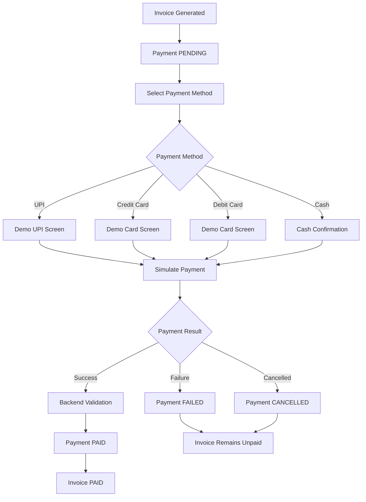
```mermaid
flowchart TD
    A[Invoice Generated] --> B[Payment PENDING]
    B --> C[Select Payment Method]
    C --> D{Payment Method}
    D -->|UPI| E[Demo UPI Screen]
    D -->|Credit Card| F[Demo Card Screen]
    D -->|Debit Card| G[Demo Card Screen]
    D -->|Cash| H[Cash Confirmation]
    E --> I[Simulate Payment]
    F --> I
    G --> I
    H --> I
    I --> J{Payment Result}
    J -->|Success| K[Backend Validation]
    J -->|Failure| L[Payment FAILED]
    J -->|Cancelled| M[Payment CANCELLED]
    K --> N[Payment PAID]
    N --> O[Invoice PAID]
    L --> P[Invoice Remains Unpaid]
    M --> P
```

### Important

No real:

* Razorpay
* Stripe
* PayPal
* Bank gateway
* UPI transaction

is used.

A QR code may be displayed for the demo, but it represents a **TAMS simulated payment reference and amount**, not a real bank transaction.

---

# 5. Vehicle Availability

Vehicle availability is calculated using booking and vehicle status information.

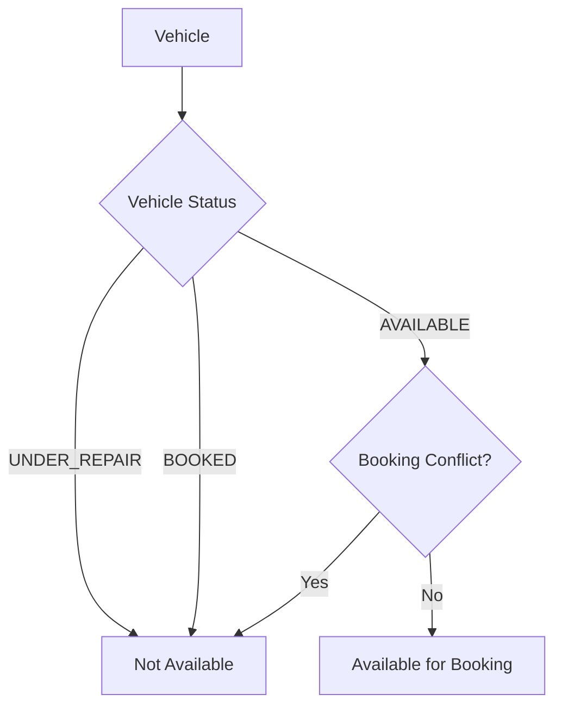
```mermaid
flowchart TD
    A[Vehicle] --> B{Vehicle Status}
    B -->|UNDER_REPAIR| C[Not Available]
    B -->|BOOKED| C
    B -->|AVAILABLE| D{Booking Conflict?}
    D -->|Yes| C
    D -->|No| E[Available for Booking]
```

---

# 6. Maintenance and Repair Management

The system records vehicle maintenance and repairs.

Maintenance records may contain:

* Vehicle
* Service type
* Service date
* Next service date
* Cost
* Notes
* Status

The system can identify vehicles approaching their next service date.

### Maintenance flow

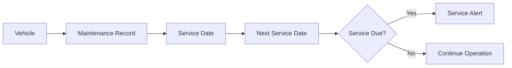
```mermaid
flowchart LR
    A[Vehicle] --> B[Maintenance Record]
    B --> C[Service Date]
    C --> D[Next Service Date]
    D --> E{Service Due?}
    E -->|Yes| F[Service Alert]
    E -->|No| G[Continue Operation]
```

---

# 7. Fuel Management

Fuel records can contain:

* Vehicle
* Trip
* Fuel quantity
* Fuel cost
* Date
* Odometer
* Mileage
* Possible anomaly flag

Fuel information is used for fleet analysis.

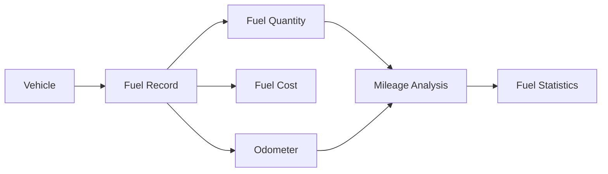
```mermaid
flowchart LR
    A[Vehicle] --> B[Fuel Record]
    B --> C[Fuel Quantity]
    B --> D[Fuel Cost]
    B --> E[Odometer]
    C --> F[Mileage Analysis]
    E --> F
    F --> G[Fuel Statistics]
```

---

# 8. Reports and Analytics

TAMS provides reporting for:

### Revenue

* Revenue by day
* Revenue by month
* Revenue by vehicle
* Revenue by route

### Booking

* Number of bookings
* Booking trends
* Popular routes

### Fleet

* Vehicle utilization
* Vehicle downtime
* Vehicle profitability

### Fuel

* Fuel consumption
* Fuel cost
* Mileage

### Maintenance

* Repair history
* Maintenance cost
* Upcoming service

### Demand

* Peak periods
* Popular routes
* Customer preferences

---

# 9. Fleet Performance

Fleet performance combines operational data from multiple modules.

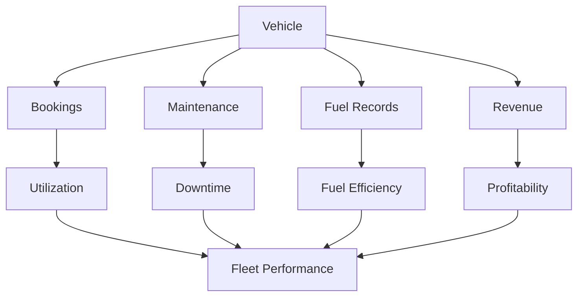
```mermaid
flowchart TD
    A[Vehicle] --> B[Bookings]
    A --> C[Maintenance]
    A --> D[Fuel Records]
    A --> E[Revenue]

    B --> F[Utilization]
    C --> G[Downtime]
    D --> H[Fuel Efficiency]
    E --> I[Profitability]

    F --> J[Fleet Performance]
    G --> J
    H --> J
    I --> J
```

---

# 10. Complete System Architecture

TAMS uses one Django backend and one PostgreSQL database for both clients.

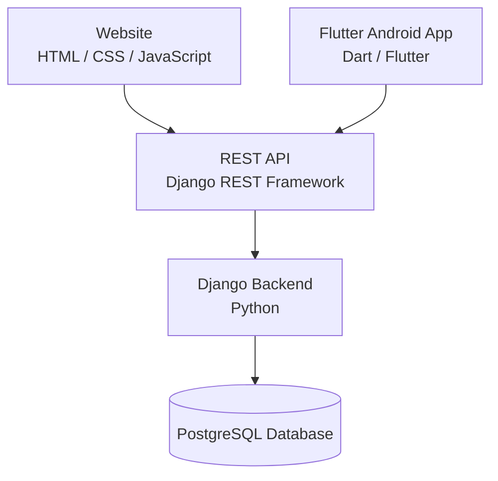
```mermaid
flowchart TB
    W[Website<br/>HTML / CSS / JavaScript]
    M[Flutter Android App<br/>Dart / Flutter]

    W --> API[REST API<br/>Django REST Framework]
    M --> API

    API --> DJ[Django Backend<br/>Python]
    DJ --> DB[(PostgreSQL Database)]
```

### Architecture principle

```text
Website
     \
      \
       → Django REST API → PostgreSQL
      /
     /
Flutter
```

Both clients use the same:

* Backend
* Authentication
* Business rules
* Database
* API
* Records

There is no separate database for Flutter.

---

# 11. Technology Stack

| Layer               | Technology                     |
| ------------------- | ------------------------------ |
| Web Frontend        | HTML, CSS, JavaScript          |
| Mobile              | Flutter / Dart                 |
| Android Development | Android Studio                 |
| Backend             | Python                         |
| Framework           | Django                         |
| API                 | Django REST Framework          |
| Database            | PostgreSQL                     |
| API Format          | REST / JSON                    |
| Communication       | HTTPS                          |
| Charts              | Chart.js / backend report data |
| Testing             | pytest / pytest-django         |
| Version Control     | Git / GitHub                   |

---

# 12. Backend Structure

A suggested Django structure is:

```text
tams_backend/
│
├── manage.py
│
├── config/
│   ├── settings.py
│   ├── urls.py
│   ├── wsgi.py
│   └── asgi.py
│
├── accounts/
├── customers/
├── vehicles/
├── drivers/
├── bookings/
├── duty_slips/
├── billing/
├── payments/
├── maintenance/
├── fuel/
└── reports/
```

Each module is responsible for a specific business area.

---

# 13. Database Design

The major entities are:

```text
Users
Customers
Vehicles
Vehicle Types
Drivers
Routes
Bookings
Driver Assignments
Duty Slips
Invoices
Invoice Items
Payments
Maintenance Records
Fuel Records
Tax Settings
Notifications
```

---

# 14. Entity Relationship Diagram

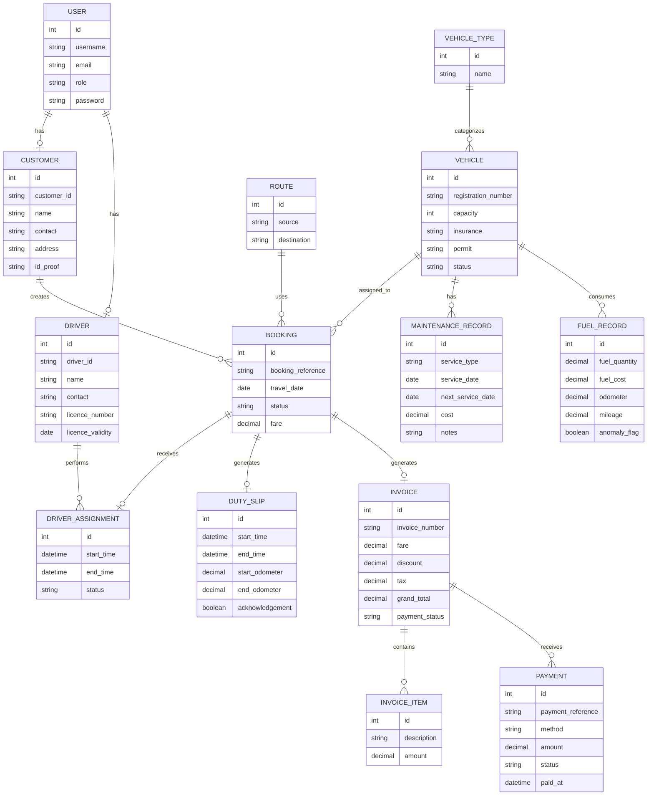
```mermaid
erDiagram

    USER ||--o| CUSTOMER : has
    USER ||--o| DRIVER : has

    CUSTOMER ||--o{ BOOKING : creates
    VEHICLE ||--o{ BOOKING : assigned_to
    VEHICLE_TYPE ||--o{ VEHICLE : categorizes
    ROUTE ||--o{ BOOKING : uses

    BOOKING ||--o| DRIVER_ASSIGNMENT : receives
    DRIVER ||--o{ DRIVER_ASSIGNMENT : performs

    BOOKING ||--o| DUTY_SLIP : generates
    BOOKING ||--o| INVOICE : generates

    INVOICE ||--o{ INVOICE_ITEM : contains
    INVOICE ||--o{ PAYMENT : receives

    VEHICLE ||--o{ MAINTENANCE_RECORD : has
    VEHICLE ||--o{ FUEL_RECORD : consumes

    USER {
        int id
        string username
        string email
        string role
        string password
    }

    CUSTOMER {
        int id
        string customer_id
        string name
        string contact
        string address
        string id_proof
    }

    VEHICLE {
        int id
        string registration_number
        int capacity
        string insurance
        string permit
        string status
    }

    VEHICLE_TYPE {
        int id
        string name
    }

    DRIVER {
        int id
        string driver_id
        string name
        string contact
        string licence_number
        date licence_validity
    }

    ROUTE {
        int id
        string source
        string destination
    }

    BOOKING {
        int id
        string booking_reference
        date travel_date
        string status
        decimal fare
    }

    DRIVER_ASSIGNMENT {
        int id
        datetime start_time
        datetime end_time
        string status
    }

    DUTY_SLIP {
        int id
        datetime start_time
        datetime end_time
        decimal start_odometer
        decimal end_odometer
        boolean acknowledgement
    }

    INVOICE {
        int id
        string invoice_number
        decimal fare
        decimal discount
        decimal tax
        decimal grand_total
        string payment_status
    }

    INVOICE_ITEM {
        int id
        string description
        decimal amount
    }

    PAYMENT {
        int id
        string payment_reference
        string method
        decimal amount
        string status
        datetime paid_at
    }

    MAINTENANCE_RECORD {
        int id
        string service_type
        date service_date
        date next_service_date
        decimal cost
        string notes
    }

    FUEL_RECORD {
        int id
        decimal fuel_quantity
        decimal fuel_cost
        decimal odometer
        decimal mileage
        boolean anomaly_flag
    }
```

---

# 15. Important Database Relationships

```text
Customer 1 ─── * Booking

Vehicle 1 ─── * Booking

Driver 1 ─── * DriverAssignment

Booking 1 ─── 1 DriverAssignment

Booking 1 ─── 1 DutySlip

Booking 1 ─── 1 Invoice

Invoice 1 ─── * Payment

Vehicle 1 ─── * MaintenanceRecord

Vehicle 1 ─── * FuelRecord
```

The exact implementation should follow the actual Django models.

---

# 16. Business Rules

The backend enforces the main business rules.

### Vehicle rules

```text
UNDER_REPAIR → Cannot be booked
```

### Double booking

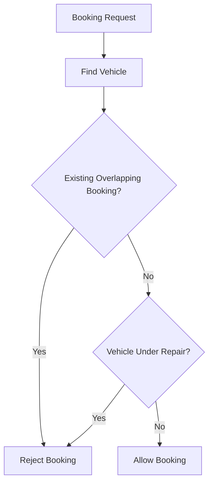
```mermaid
flowchart TD
    A[Booking Request] --> B[Find Vehicle]
    B --> C{Existing Overlapping Booking?}
    C -->|Yes| D[Reject Booking]
    C -->|No| E{Vehicle Under Repair?}
    E -->|Yes| D
    E -->|No| F[Allow Booking]
```

### Driver assignment

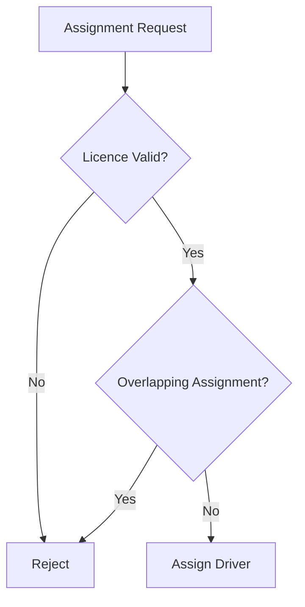
```mermaid
flowchart TD
    A[Assignment Request] --> B{Licence Valid?}
    B -->|No| C[Reject]
    B -->|Yes| D{Overlapping Assignment?}
    D -->|Yes| C
    D -->|No| E[Assign Driver]
```

### Payment

```text
Payment not verified
        ↓
Invoice remains unpaid

Successful simulated payment
        ↓
Backend validates
        ↓
Payment = PAID
        ↓
Invoice = PAID
```

### Tax

The tax rate is configurable rather than permanently hard-coded.

```text
Fare
- Discount
= Taxable Amount

Taxable Amount + Tax
= Grand Total
```

---

# 17. API Architecture

The API follows REST principles.

Base structure:

```text
/api/v1/
│
├── customers/
├── vehicles/
├── drivers/
├── bookings/
├── assignments/
├── duty-slips/
├── invoices/
├── payments/
├── maintenance/
├── fuel/
└── reports/
```

---

# 18. CRUD API Pattern

For example, customer management:

```text
GET     /api/v1/customers/
POST    /api/v1/customers/

GET     /api/v1/customers/{id}/
PUT     /api/v1/customers/{id}/
PATCH   /api/v1/customers/{id}/
DELETE  /api/v1/customers/{id}/
```

The same REST pattern can be applied to other resources where appropriate.

---

# 19. Authentication and Authorization

Authentication flow:

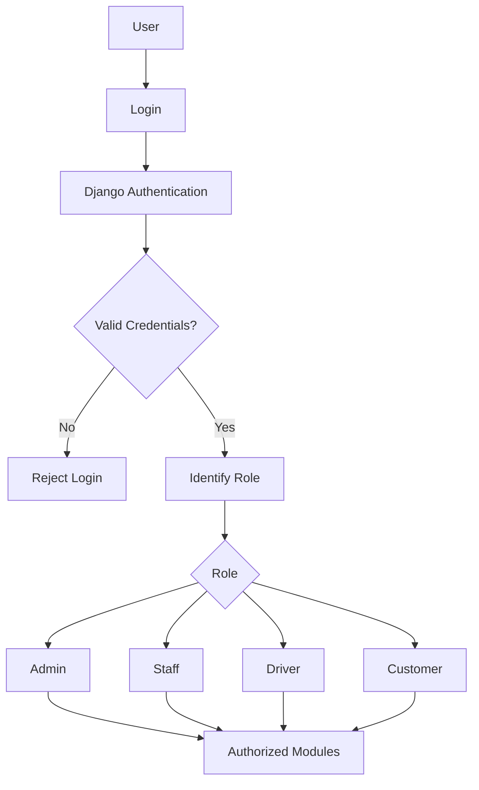
```mermaid
flowchart TD
    A[User] --> B[Login]
    B --> C[Django Authentication]
    C --> D{Valid Credentials?}
    D -->|No| E[Reject Login]
    D -->|Yes| F[Identify Role]
    F --> G{Role}
    G --> H[Admin]
    G --> I[Staff]
    G --> J[Driver]
    G --> K[Customer]

    H --> L[Authorized Modules]
    I --> L
    J --> L
    K --> L
```

Backend permissions determine which operations each role can perform.

---

# 20. Role Permissions

## Admin

Admin can manage:

* Users
* Customers
* Vehicles
* Drivers
* Bookings
* Assignments
* Duty slips
* Invoices
* Payments
* Maintenance
* Fuel
* Reports
* System settings

---

## Staff

Staff can manage operational tasks such as:

* Customers
* Vehicles
* Drivers
* Bookings
* Driver assignments
* Duty slips
* Invoices
* Payments

---

## Driver

Driver can access:

* Assigned trips
* Assigned bookings
* Duty slips
* Trip information
* Odometer information
* Driver acknowledgement

---

## Customer

Customer can access:

* Own profile
* Vehicle search
* Own bookings
* Booking details
* Own invoices
* Payment flow

---

# 21. End-to-End Booking Workflow

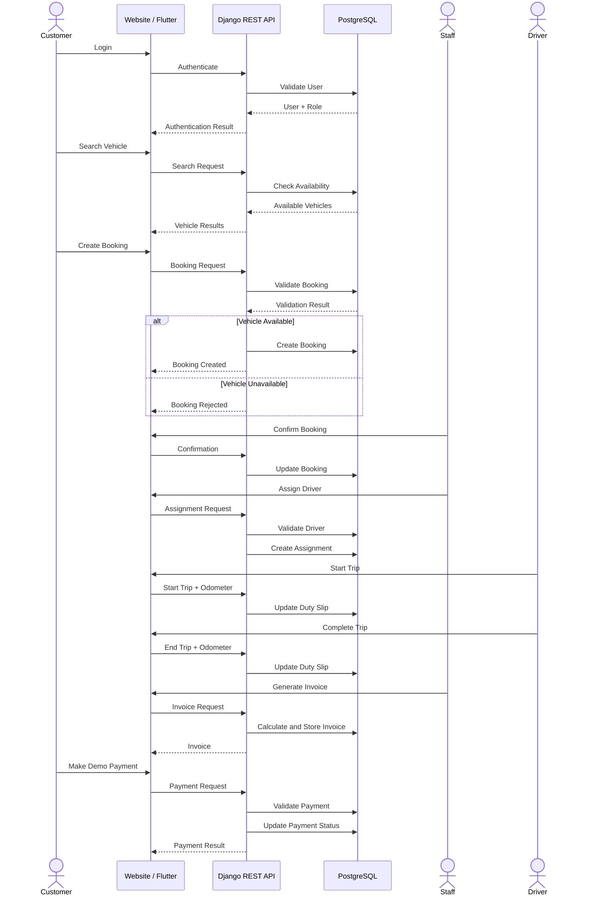
```mermaid
sequenceDiagram
    actor Customer
    participant Web as Website / Flutter
    participant API as Django REST API
    participant DB as PostgreSQL
    actor Staff
    actor Driver

    Customer->>Web: Login
    Web->>API: Authenticate
    API->>DB: Validate User
    DB-->>API: User + Role
    API-->>Web: Authentication Result

    Customer->>Web: Search Vehicle
    Web->>API: Search Request
    API->>DB: Check Availability
    DB-->>API: Available Vehicles
    API-->>Web: Vehicle Results

    Customer->>Web: Create Booking
    Web->>API: Booking Request
    API->>DB: Validate Booking
    DB-->>API: Validation Result

    alt Vehicle Available
        API->>DB: Create Booking
        API-->>Web: Booking Created
    else Vehicle Unavailable
        API-->>Web: Booking Rejected
    end

    Staff->>Web: Confirm Booking
    Web->>API: Confirmation
    API->>DB: Update Booking

    Staff->>Web: Assign Driver
    Web->>API: Assignment Request
    API->>DB: Validate Driver
    API->>DB: Create Assignment

    Driver->>Web: Start Trip
    Web->>API: Start Trip + Odometer
    API->>DB: Update Duty Slip

    Driver->>Web: Complete Trip
    Web->>API: End Trip + Odometer
    API->>DB: Update Duty Slip

    Staff->>Web: Generate Invoice
    Web->>API: Invoice Request
    API->>DB: Calculate and Store Invoice
    API-->>Web: Invoice

    Customer->>Web: Make Demo Payment
    Web->>API: Payment Request
    API->>DB: Validate Payment
    API->>DB: Update Payment Status
    API-->>Web: Payment Result
```

---

# 22. Flutter Mobile Architecture

The Flutter application is a client of the same Django REST API.

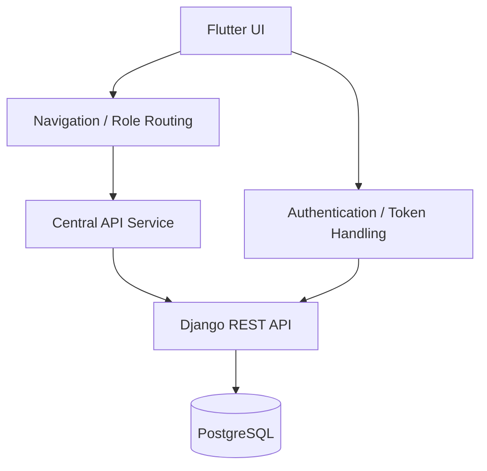
```mermaid
flowchart TB
    UI[Flutter UI]
    NAV[Navigation / Role Routing]
    SERVICE[Central API Service]
    AUTH[Authentication / Token Handling]
    API[Django REST API]
    DB[(PostgreSQL)]

    UI --> NAV
    NAV --> SERVICE
    UI --> AUTH
    SERVICE --> API
    AUTH --> API
    API --> DB
```

Flutter should not contain independent business logic that conflicts with Django.

The backend remains the source of truth.

---

# 23. Web Application Architecture

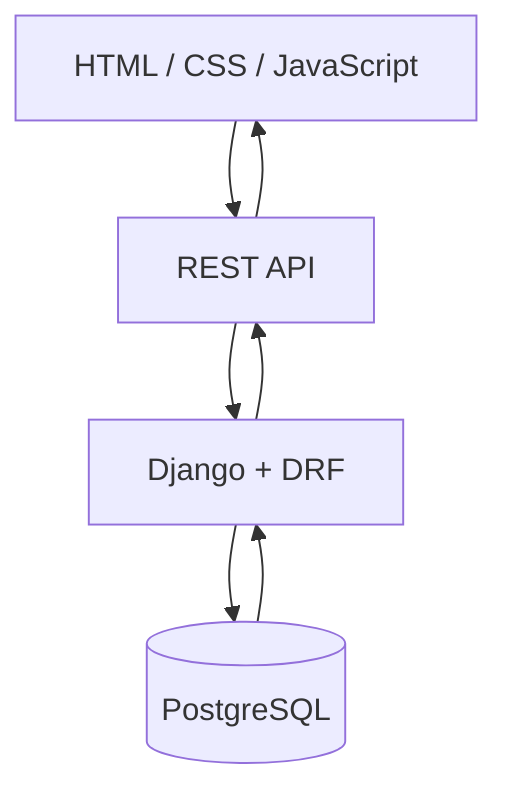
```mermaid
flowchart TB
    UI[HTML / CSS / JavaScript]
    API[REST API]
    BACKEND[Django + DRF]
    DB[(PostgreSQL)]

    UI --> API
    API --> BACKEND
    BACKEND --> DB
    DB --> BACKEND
    BACKEND --> API
    API --> UI
```

---

# 24. Shared Backend Principle

Both clients communicate with the same backend.

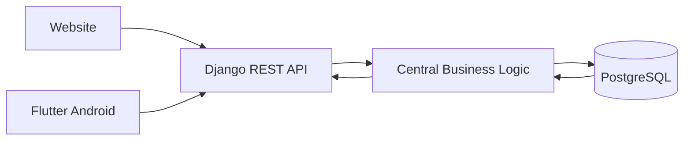
```mermaid
flowchart LR
    WEB[Website]
    APP[Flutter Android]

    WEB --> API[Django REST API]
    APP --> API

    API --> LOGIC[Central Business Logic]
    LOGIC --> DB[(PostgreSQL)]

    DB --> LOGIC
    LOGIC --> API
```

This prevents data duplication and keeps business rules consistent.

---

# 25. Example Cross-Platform Scenario

A customer can create a booking from the website.

```text
Website
   ↓
Django API
   ↓
PostgreSQL
```

The same booking can then appear in the Flutter application.

```text
Flutter
   ↓
Django API
   ↓
PostgreSQL
   ↓
Booking retrieved
```

Similarly, a staff member can update a booking from the web application and the Flutter application can retrieve the updated data.

---

# 26. Data Flow

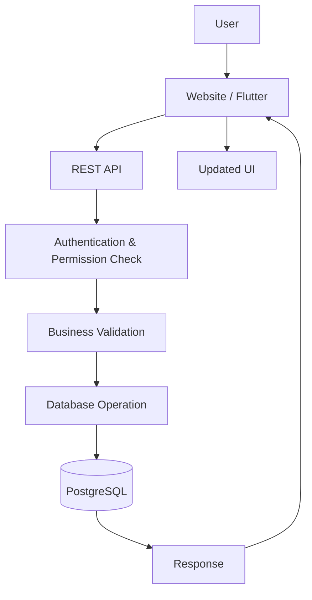
```mermaid
flowchart TD
    A[User] --> B[Website / Flutter]
    B --> C[REST API]
    C --> D[Authentication & Permission Check]
    D --> E[Business Validation]
    E --> F[Database Operation]
    F --> G[(PostgreSQL)]
    G --> H[Response]
    H --> B
    B --> I[Updated UI]
```

---

# 27. Project-Level Data Flow

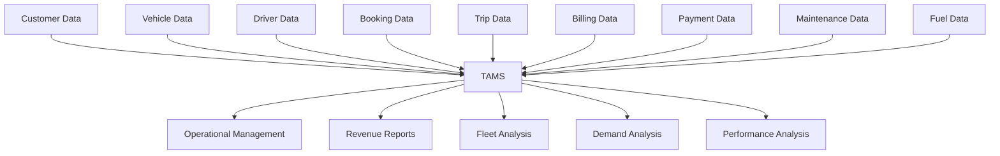
```mermaid
flowchart TD
    A[Customer Data] --> B[TAMS]
    C[Vehicle Data] --> B
    D[Driver Data] --> B
    E[Booking Data] --> B
    F[Trip Data] --> B
    G[Billing Data] --> B
    H[Payment Data] --> B
    I[Maintenance Data] --> B
    J[Fuel Data] --> B

    B --> K[Operational Management]
    B --> L[Revenue Reports]
    B --> M[Fleet Analysis]
    B --> N[Demand Analysis]
    B --> O[Performance Analysis]
```

---

# 28. System State Flow

The main booking/trip lifecycle can be represented as:

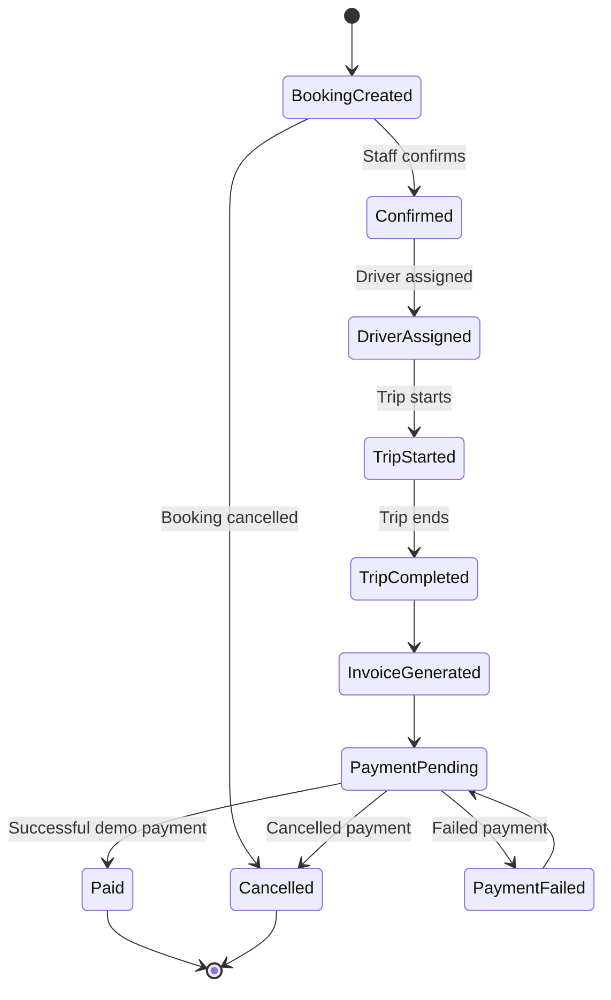
```mermaid
stateDiagram-v2
    [*] --> BookingCreated

    BookingCreated --> Confirmed: Staff confirms
    BookingCreated --> Cancelled: Booking cancelled

    Confirmed --> DriverAssigned: Driver assigned
    DriverAssigned --> TripStarted: Trip starts

    TripStarted --> TripCompleted: Trip ends

    TripCompleted --> InvoiceGenerated
    InvoiceGenerated --> PaymentPending

    PaymentPending --> Paid: Successful demo payment
    PaymentPending --> PaymentFailed: Failed payment
    PaymentPending --> Cancelled: Cancelled payment

    PaymentFailed --> PaymentPending
    Paid --> [*]
    Cancelled --> [*]
```

---

# 29. Vehicle Lifecycle

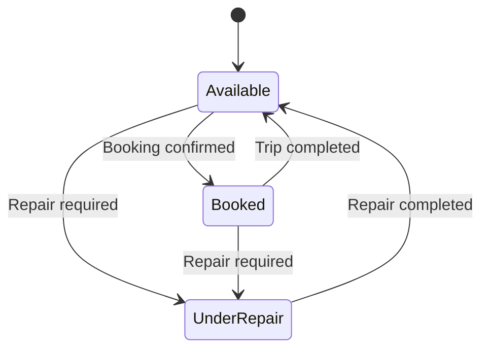
```mermaid
stateDiagram-v2
    [*] --> Available

    Available --> Booked: Booking confirmed
    Booked --> Available: Trip completed

    Available --> UnderRepair: Repair required
    Booked --> UnderRepair: Repair required

    UnderRepair --> Available: Repair completed
```

---

# 30. Major Modules

```text
TAMS
│
├── Authentication & RBAC
│
├── Customer Management
│
├── Vehicle/Fleet Management
│
├── Driver Management
│
├── Booking Management
│
├── Driver Assignment
│
├── Duty Slip Management
│
├── Billing & Invoice
│
├── Simulated Payment
│
├── Maintenance
│
├── Fuel Management
│
└── Reports & Analytics
```

---

# 31. Module Relationship

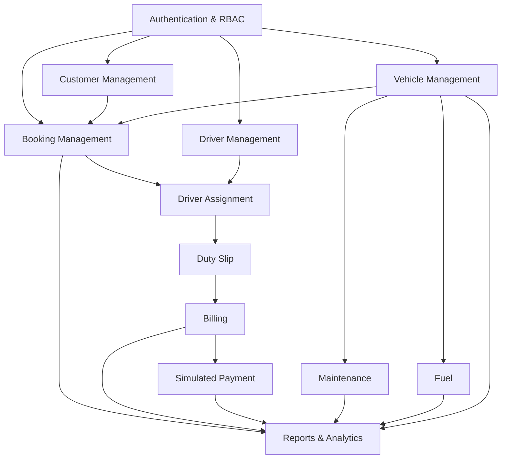
```mermaid
flowchart TD
    AUTH[Authentication & RBAC]

    CUSTOMER[Customer Management]
    VEHICLE[Vehicle Management]
    DRIVER[Driver Management]
    BOOKING[Booking Management]
    ASSIGN[Driver Assignment]
    DUTY[Duty Slip]
    BILL[Billing]
    PAYMENT[Simulated Payment]
    MAINT[Maintenance]
    FUEL[Fuel]
    REPORT[Reports & Analytics]

    AUTH --> CUSTOMER
    AUTH --> VEHICLE
    AUTH --> DRIVER
    AUTH --> BOOKING

    CUSTOMER --> BOOKING
    VEHICLE --> BOOKING
    BOOKING --> ASSIGN
    DRIVER --> ASSIGN
    ASSIGN --> DUTY
    DUTY --> BILL
    BILL --> PAYMENT

    VEHICLE --> MAINT
    VEHICLE --> FUEL

    BOOKING --> REPORT
    BILL --> REPORT
    PAYMENT --> REPORT
    MAINT --> REPORT
    FUEL --> REPORT
    VEHICLE --> REPORT
```

---

# 32. User Journey

## Customer

```text
Register/Login
     ↓
Search Vehicle
     ↓
Check Availability
     ↓
Create Booking
     ↓
View Booking
     ↓
View Invoice
     ↓
Demo Payment
     ↓
View Payment Status
```

## Staff

```text
Login
 ↓
Dashboard
 ↓
Manage Customers
 ↓
Manage Vehicles
 ↓
Manage Drivers
 ↓
Confirm Bookings
 ↓
Assign Drivers
 ↓
Manage Duty Slips
 ↓
Generate Invoices
 ↓
Process Demo Payments
 ↓
View Reports
```

## Driver

```text
Login
 ↓
View Assigned Trips
 ↓
Open Duty Slip
 ↓
Start Trip
 ↓
Record Start Odometer
 ↓
Complete Trip
 ↓
Record End Odometer
 ↓
Acknowledge Duty Slip
```

## Admin

```text
Login
 ↓
System Dashboard
 ↓
Manage Users
 ↓
Manage Operational Data
 ↓
Manage Settings
 ↓
View Reports
 ↓
Monitor Overall System
```

---

# 33. Security and Data Protection

TAMS uses standard application-level security practices.

### Authentication

Users must authenticate before accessing protected modules.

### Authorization

Permissions are enforced at the backend.

### Passwords

Passwords should be stored using Django's password hashing mechanism rather than plain text.

### HTTPS

Production API communication should use HTTPS.

### Payment Security

Because payments are simulated:

* No real card data is processed.
* No banking credentials are stored.
* No real financial transaction occurs.

### Data Integrity

Backend validation is used for:

* booking conflicts
* driver assignment conflicts
* licence validity
* invoice totals
* payment status
* vehicle status

---

# 34. Backup and Availability

The system is designed around:

* PostgreSQL database
* Daily automated backups
* Data recovery planning
* Backend validation
* Centralized data storage

The original system requirements target approximately **99.5% availability**, excluding planned maintenance.

---

# 35. Performance Requirement

The system is intended to support booking searches within approximately:

```text
< 3 seconds
```

for the stated target of up to:

```text
100 concurrent users
```

Actual performance should be validated through testing under the deployment environment.

---

# 36. Testing Strategy

Testing should cover:

1. Authentication
2. Role permissions
3. Customer CRUD
4. Vehicle CRUD
5. Vehicle availability
6. Booking creation
7. Double-booking prevention
8. Driver CRUD
9. Licence validation
10. Driver assignment
11. Assignment conflict prevention
12. Duty slips
13. Odometer validation
14. Invoice calculation
15. Tax calculation
16. Discount calculation
17. Simulated payment
18. Maintenance records
19. Fuel records
20. Reports
21. API integration
22. End-to-end workflows
23. Mutation testing

Recommended tools:

```text
pytest
pytest-django
Django Test Framework
Flutter testing tools
API testing tools
```

---

# 37. Testing Flow

```mermaid
flowchart TD
    A[Requirement] --> B[Test Case Design]
    B --> C[Unit Testing]
    C --> D[API Testing]
    D --> E[Integration Testing]
    E --> F[End-to-End Testing]
    F --> G[Mutation Testing]
    G --> H[Test Report]
```

---

# 38. Example Test Cases

| Test ID | Test                          | Expected Result          |
| ------- | ----------------------------- | ------------------------ |
| TC-01   | Valid login                   | User logged in           |
| TC-02   | Invalid login                 | Login rejected           |
| TC-03   | Customer creation             | Customer created         |
| TC-04   | Vehicle creation              | Vehicle created          |
| TC-05   | Book available vehicle        | Booking created          |
| TC-06   | Book already-booked vehicle   | Booking rejected         |
| TC-07   | Assign valid driver           | Assignment created       |
| TC-08   | Assign expired licence        | Assignment rejected      |
| TC-09   | Overlapping driver assignment | Assignment rejected      |
| TC-10   | Generate invoice              | Invoice created          |
| TC-11   | Calculate tax                 | Correct tax applied      |
| TC-12   | Successful demo payment       | Payment marked PAID      |
| TC-13   | Failed demo payment           | Invoice remains unpaid   |
| TC-14   | Vehicle under repair          | Vehicle unavailable      |
| TC-15   | Fuel record                   | Record stored            |
| TC-16   | Maintenance record            | Record stored            |
| TC-17   | Revenue report                | Correct report generated |

---

# 39. Development Workflow

```mermaid
flowchart LR
    A[Requirement Analysis]
    B[Database Design]
    C[Django Backend]
    D[REST API]
    E[Website]
    F[Flutter App]
    G[Testing]
    H[Integration]
    I[Deployment]

    A --> B
    B --> C
    C --> D
    D --> E
    D --> F
    E --> G
    F --> G
    G --> H
    H --> I
```

---

# 40. Installation

## Prerequisites

Install:

* Python 3.x
* PostgreSQL
* Django
* Django REST Framework
* Flutter SDK
* Dart
* Android Studio
* Git

---

# 41. Clone Repository

```bash
git clone <repository-url>
cd TAMS
```

Replace `<repository-url>` with the actual repository URL.

---

# 42. Backend Setup

Create a virtual environment:

```bash
python -m venv venv
```

Activate on Windows:

```bash
venv\Scripts\activate
```

Activate on Linux/macOS:

```bash
source venv/bin/activate
```

Install dependencies:

```bash
pip install -r requirements.txt
```

---

# 43. Environment Configuration

Create a `.env` file for local configuration.

Example:

```env
DEBUG=True

SECRET_KEY=your-development-secret-key

DB_NAME=tams
DB_USER=postgres
DB_PASSWORD=your-password
DB_HOST=localhost
DB_PORT=5432

API_BASE_URL=http://127.0.0.1:8000
```

Do not commit real secrets to GitHub.

---

# 44. PostgreSQL Setup

Create a PostgreSQL database:

```sql
CREATE DATABASE tams;
```

Configure the Django database connection using environment variables.

Then run:

```bash
python manage.py makemigrations
python manage.py migrate
```

---

# 45. Create Admin User

```bash
python manage.py createsuperuser
```

Follow the prompts.

Start the backend:

```bash
python manage.py runserver
```

The development server normally runs at:

```text
http://127.0.0.1:8000/
```

---

# 46. Flutter Setup

Navigate to the Flutter project:

```bash
cd mobile
```

Install packages:

```bash
flutter pub get
```

Check the environment:

```bash
flutter doctor
```

Run the application:

```bash
flutter run
```

Configure the Flutter API base URL to point to the Django server.

For an Android emulator, the host machine may be accessed using:

```text
http://10.0.2.2:8000
```

The exact configuration should follow the project's API service implementation.

---

# 47. Website Setup

The website communicates with the Django REST API.

For a simple development setup, serve the frontend using the project's configured development method.

The website should be configured with the Django API base URL.

---

# 48. Demo Credentials

For development/demo purposes, the following accounts can be created through Django:

| Role     | Email                 | Password           |
| -------- | --------------------- | ------------------ |
| Admin    | `admin@tams.local`    | `TamsAdmin@123`    |
| Staff    | `staff@tams.local`    | `TamsStaff@123`    |
| Driver   | `driver@tams.local`   | `TamsDriver@123`   |
| Customer | `customer@tams.local` | `TamsCustomer@123` |

These are **development/demo credentials only**.

Passwords should be created through Django's password hashing system and should not be hard-coded into Flutter source code.

---

# 49. Recommended Demo Flow

For a complete project demonstration:

```mermaid
flowchart TD
    A[Login as Admin] --> B[Create Vehicle]
    B --> C[Create Driver]
    C --> D[Create Customer]

    D --> E[Login as Customer]
    E --> F[Search Vehicle]
    F --> G[Create Booking]

    G --> H[Login as Staff]
    H --> I[Confirm Booking]
    I --> J[Assign Driver]
    J --> K[Generate Duty Slip]

    K --> L[Login as Driver]
    L --> M[Start Trip]
    M --> N[Enter Odometer]
    N --> O[Complete Trip]

    O --> P[Staff Generates Invoice]
    P --> Q[Customer Opens Invoice]
    Q --> R[Demo Payment]
    R --> S[Payment Successful]
    S --> T[Invoice Paid]

    T --> U[View Reports]
```

This demonstrates the complete lifecycle instead of showing disconnected CRUD screens.

---

# 50. Cross-Platform Demo

A useful demonstration is:

```text
STEP 1
Create booking from Website

        ↓

STEP 2
Store booking in PostgreSQL

        ↓

STEP 3
Open Flutter App

        ↓

STEP 4
Retrieve same booking through Django API

        ↓

STEP 5
Update booking from Flutter

        ↓

STEP 6
Verify updated booking on Website
```

This proves that both applications use the same backend and database.

---

# 51. Out of Scope

The following are intentionally outside the project scope:

* Real payment gateways
* Real banking transactions
* GPS/live vehicle tracking
* Native iOS application
* Blockchain
* Microservices
* Separate backend for mobile
* Separate mobile database as source of truth
* Firebase as the authoritative database
* Supabase as the authoritative database
* Unnecessary machine-learning systems

Flutter Android is included as the project's mobile extension.

---

# 52. Design Principles

TAMS follows these principles:

### Single Source of Truth

```text
Website ─┐
         ├── Django REST API ── PostgreSQL
Flutter ─┘
```

### Centralized Business Logic

Business rules are enforced by Django rather than duplicated independently in JavaScript and Dart.

### API-First Communication

Clients communicate with the backend through REST APIs.

### Role-Based Access

Different users receive different capabilities.

### Backend Validation

Important operations are validated on the server.

### Simple Architecture

The project avoids unnecessary technologies and infrastructure.

---

# 53. Why Django + PostgreSQL?

Django provides:

* Authentication
* ORM
* Admin interface
* Request handling
* Validation
* Security features
* Rapid development

Django REST Framework provides:

* REST APIs
* Serializers
* API authentication
* Permissions
* Viewsets
* API validation

PostgreSQL provides:

* Relational data storage
* Transactions
* Constraints
* Reliable structured data
* Good support for complex relationships

---

# 54. Why Flutter?

Flutter provides a single Android application codebase using Dart.

It allows the same TAMS backend to serve:

```text
Website
   +
Android Application
```

without creating a separate backend.

---

# 55. Project Folder Structure

A complete repository can follow:

```text
TAMS/
│
├── backend/
│   ├── manage.py
│   ├── config/
│   ├── accounts/
│   ├── customers/
│   ├── vehicles/
│   ├── drivers/
│   ├── bookings/
│   ├── duty_slips/
│   ├── billing/
│   ├── payments/
│   ├── maintenance/
│   ├── fuel/
│   ├── reports/
│   └── requirements.txt
│
├── website/
│   ├── index.html
│   ├── css/
│   ├── js/
│   └── assets/
│
├── mobile/
│   ├── lib/
│   ├── android/
│   ├── test/
│   └── pubspec.yaml
│
├── docs/
│   ├── architecture/
│   ├── diagrams/
│   ├── testing/
│   └── api/
│
├── .gitignore
├── README.md
└── LICENSE
```

The actual structure should be updated to match the repository rather than creating unnecessary folders.

---

# 56. Git Workflow

Basic workflow:

```bash
git status
git add .
git commit -m "Update TAMS"
git push
```

Do not commit:

```text
.env
venv/
__pycache__/
*.pyc
build/
.dart_tool/
.idea/
```

A suitable `.gitignore` should be maintained for Python, Django, Flutter and Android build files.

---

# 57. API Example

Example booking creation:

```http
POST /api/v1/bookings/
Content-Type: application/json
Authorization: Bearer <token>
```

Example request:

```json
{
  "customer": 1,
  "vehicle": 5,
  "route": 2,
  "travel_date": "2026-10-20",
  "fare": 5000
}
```

The backend should validate:

```text
Customer exists
        ↓
Vehicle exists
        ↓
Vehicle available
        ↓
No overlapping booking
        ↓
Valid booking
```

---

# 58. Example Payment API

```http
POST /api/v1/payments/
Content-Type: application/json
Authorization: Bearer <token>
```

Example:

```json
{
  "invoice": 12,
  "method": "UPI",
  "amount": 5900
}
```

The backend determines whether the simulated payment can be marked successful.

The Flutter or website client should not directly change:

```text
payment.status = PAID
```

without backend validation.

---

# 59. Error Handling

The clients should handle:

* Network failure
* Authentication failure
* Permission denied
* Validation errors
* Booking conflicts
* Driver conflicts
* Server errors
* Empty results
* Payment failure

The UI should provide:

```text
Loading State
Empty State
Error State
Success State
Refresh / Retry
```

---

# 60. Future Enhancements

Possible future improvements include:

* Real payment gateway integration
* GPS/live tracking
* Customer notifications
* Email/SMS notifications
* Multi-branch management
* Advanced demand forecasting
* Automated maintenance prediction
* Driver performance analysis
* Cloud deployment
* Native iOS support

These are future possibilities and are not required for the current implementation.

---

# 61. Project Limitations

The current project intentionally uses simulated payment rather than real financial processing.

GPS/live tracking is not implemented.

The system is designed primarily as an academic/project demonstration and can be expanded for production deployment with additional infrastructure, security hardening, monitoring, compliance, and payment integration.

---

# 62. Overall System Flow

```mermaid
flowchart TD
    START([Start]) --> LOGIN[Login / Register]

    LOGIN --> ROLE{User Role}

    ROLE -->|Customer| CUSTOMER[Customer Operations]
    ROLE -->|Staff| STAFF[Staff Operations]
    ROLE -->|Driver| DRIVER[Driver Operations]
    ROLE -->|Admin| ADMIN[Admin Operations]

    CUSTOMER --> SEARCH[Search Vehicles]
    SEARCH --> AVAIL[Check Availability]
    AVAIL --> BOOK[Create Booking]

    STAFF --> CONFIRM[Confirm Booking]
    CONFIRM --> ASSIGN[Assign Driver]

    DRIVER --> TRIP[Perform Assigned Trip]
    ASSIGN --> TRIP

    TRIP --> DUTY[Update Duty Slip]
    DUTY --> COMPLETE[Complete Trip]

    COMPLETE --> INVOICE[Generate Invoice]
    INVOICE --> TAX[Calculate Tax]
    TAX --> PAYMENT[Demo Payment]

    PAYMENT --> STATUS{Payment Result}

    STATUS -->|Success| PAID[Invoice Paid]
    STATUS -->|Failed| UNPAID[Invoice Unpaid]
    STATUS -->|Cancelled| UNPAID

    PAID --> REPORTS[Reports & Analytics]
    UNPAID --> REPORTS

    ADMIN --> MANAGEMENT[System Management]
    MANAGEMENT --> REPORTS

    VEH[Vehicle]
    VEH --> MAINT[Maintenance]
    VEH --> FUEL[Fuel Management]

    MAINT --> REPORTS
    FUEL --> REPORTS

    REPORTS --> END([End])
```

---

# 63. Complete TAMS Concept

The entire system can be summarized as:

```text
                    TRAVEL AGENCY
                         │
             ┌───────────┴───────────┐
             │                       │
        CUSTOMER SIDE          AGENCY SIDE
             │                       │
       Vehicle Search          Vehicle Management
       Booking                 Driver Management
       Invoice                 Booking Management
       Payment                 Duty Slips
                               Billing
                               Maintenance
                               Fuel
                               Reports
             │                       │
             └───────────┬───────────┘
                         │
                  DJANGO REST API
                         │
                    POSTGRESQL
                         │
                 Shared Data Source
```

---

# 64. Project Summary

**Travel Agency Management System (TAMS)** is a centralized full-stack system for managing travel agency operations.

It connects:

```text
Customers
    ↓
Vehicles
    ↓
Bookings
    ↓
Drivers
    ↓
Trips
    ↓
Duty Slips
    ↓
Invoices
    ↓
Simulated Payments
    ↓
Reports
```

while also managing:

```text
Maintenance
Fuel
Vehicle Availability
Fleet Performance
Demand Analysis
Revenue Analysis
```

The system consists of:

```text
HTML/CSS/JavaScript Website
            +
Flutter Android Application
            ↓
Django + Django REST Framework
            ↓
PostgreSQL
```

Both clients share the same backend and database, making TAMS a unified travel agency management platform.

---

## License

Add the project's actual license here if one has been selected.

Example:

```text
This project is developed for academic and educational purposes.
```

---

## Contributors

Add the project contributors here.

```text
Travel Agency Management System (TAMS)

Developed as an academic software engineering project.
```
